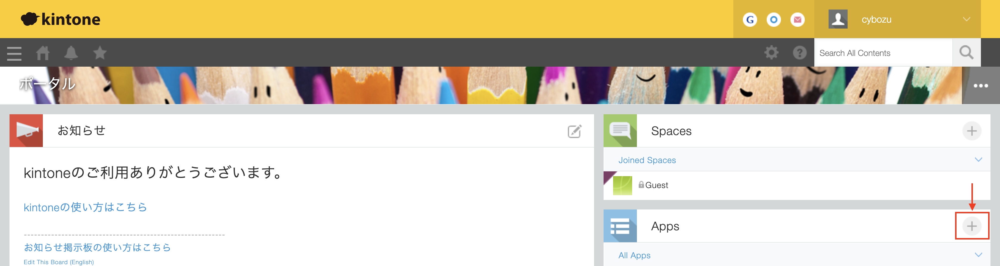
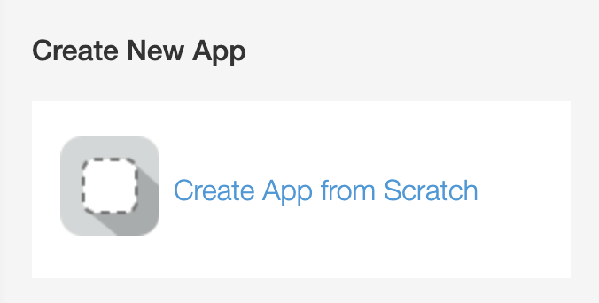
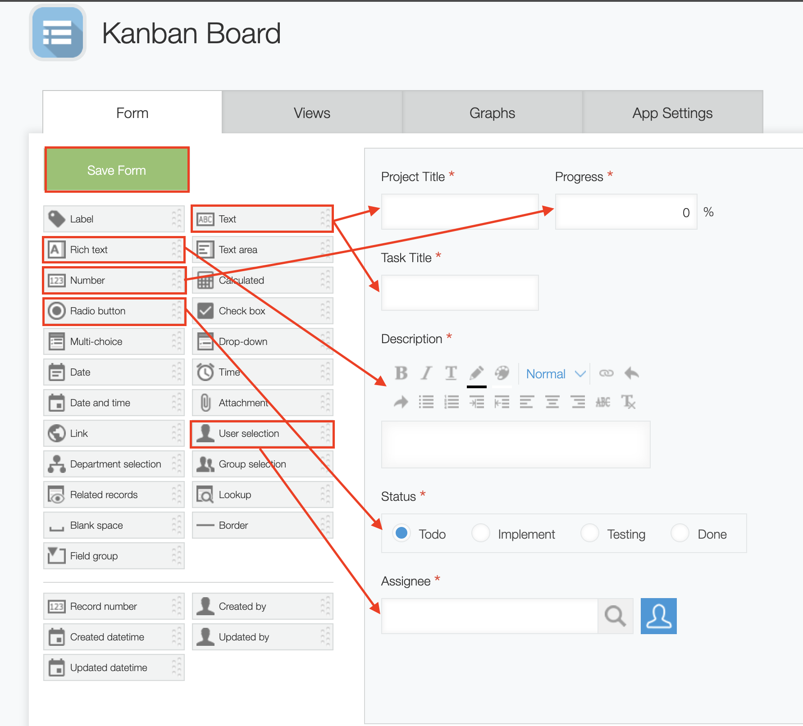
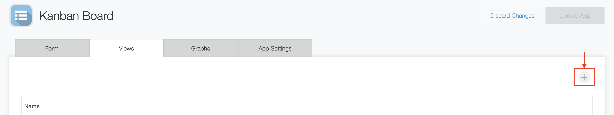
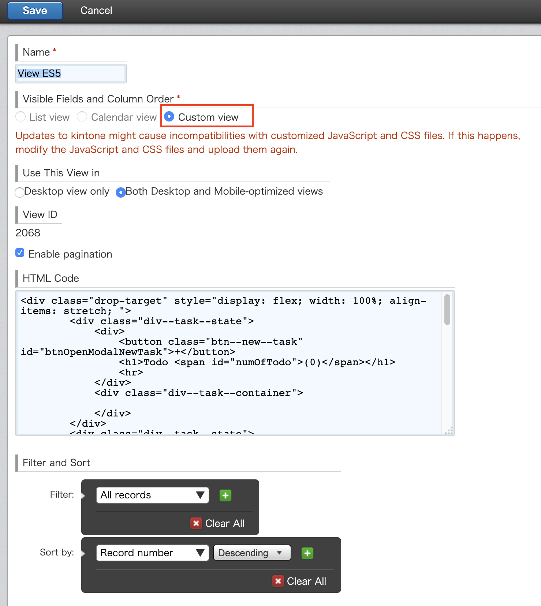
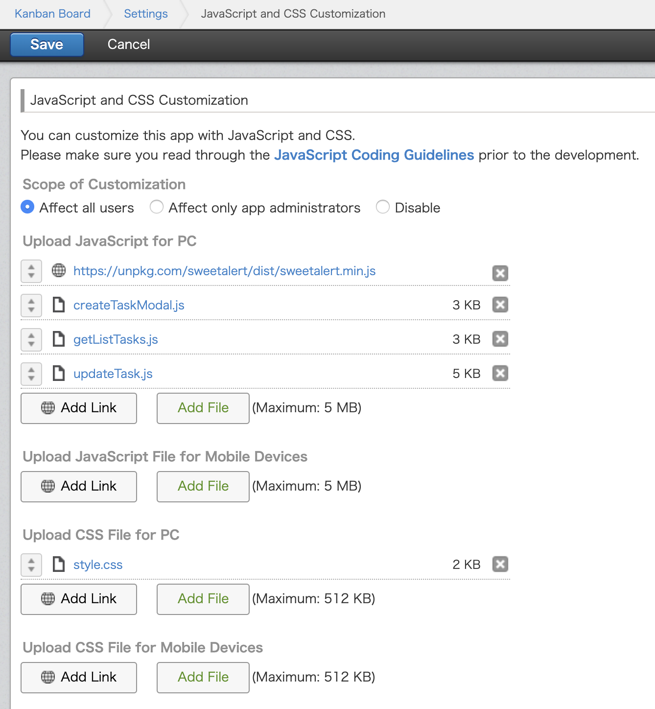

# Kanban Board


# Overview
This is a todo app for kintone application - Kanban Board App.

# Usage

## Preparing the App
### Create an App from scratch

From the Kintone portal, click the **[+]** icon within the Apps widget.



Then click Create App from Scratch to create a new Kintone App.



### Form settings
Add the following fields to the App form.
   
   
Change the settings for each field as shown below.  
  

| Field type      |     Field name      |    Field code     |Note|
| :---        |    :----:   |          ---: |  ---: |
| Text      | Project Title       | txt_projectTitle   |
| Number   | Progress        | num_progress      | range (1-100), suffix: %
|Text | Task Title | txt_taskTitle|
|Rich text| Description | rich_text_description|
|Radio button| Status| rb_status|
|User selection|Assignee | user_selection_assignee 

### Custom view settings

Next, navigate to the Views tab. Click the **[+]** button to create a new view.  
 . 
  
Select **Custom view** as the display format of the record view.  
 . 
Enter the following code in the HTML code box.  

```
 <div class="drop-target" style="display: flex; width: 100%; align-items: stretch; ">
        <div class="div--task--state">
            <div>
                <button class="btn--new--task" id="btnOpenModalNewTask">+</button>
                <h1>Todo <span id="numOfTodo">(0)</span></h1><hr>
            </div>
            <div class="div--task--container"></div>
        </div>
        <div class="div--task--state">
            <div><h1>Implement <span id="numOfImplement">(0)</span></h1><hr></div>
            <div class="div--task--container"></div>
        </div>
        <div class="div--task--state">
            <div><h1>Testing <span id="numOfTesting">(0)</span></h1><hr></div>
            <div class="div--task--container"></div>
        </div>
        <div class="div--task--state">
            <div><h1>Done <span id="numOfDone">(0)</span></h1><hr></div>
            <div class="div--task--container"></div>
        </div>
    </div>
    <!-- Quick Add Modal -->
    <div id="divCreateModal" class="modal--create--task">
        <div class="modal-content--create--task">
            <span id="closeCreateModal" class="close--div--create--task--modal">&times;</span>
            <h1>Add New Task</h1>
            <p>Project Title: </p>
            <input type="text" name="txtProjectTitle" />
            <p>Task Title</p>
            <input type="text" name="txtTaskTitle" /><br>
            <button type="submit" id="btnCreateTask">Submit</button>
        </div>
    </div>
```

Click the **Save** button, and then click **Update App** to create the App.


## Customizing with JavaScript

The javascript & css files **(getListTasks.js, createTaskModal.js, updateTask.js, style.css)** and the libraries used inside it will need to be uploaded to the JavaScript files for PC section of the JavaScript & CSS settings of the App. Refer to the [Customizing Kintone with JavaScript & CSS](https://get.kintone.help/hc/en-us/articles/115001237528-Customizing-Kintone-with-JavaScript-CSS#App) article in the Kintone Help Center for information on uploading JavaScript files and libraries to an App.

Libraries within the Kintone CDN: Specify by URL . 
- [SweetAlert](https://sweetalert.js.org/guides/)
	- https://unpkg.com/sweetalert/dist/sweetalert.min.js

Once all files have been uploaded, the settings should look like the following.  
 


Click the **Save** button, and then click **Update App** to update the App.
